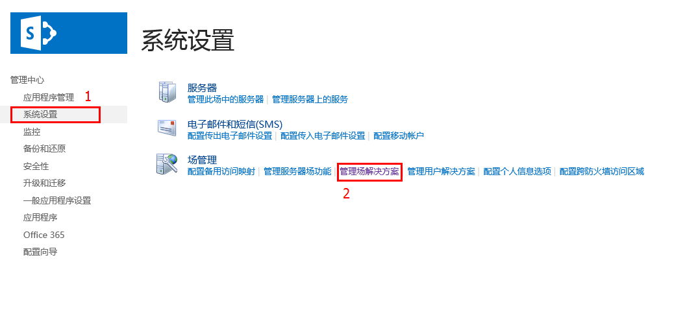

## 安装
在进行`AWorkflow 2013`安装前，请确保您仔细阅读过上一章节**安装前准备**，并对将要安装的SharePoint环境进行过数据备份，且已经下载过`AWorkflow 2013`解决方案安装包。

### 执行cmd命令
在`AWorkflow 2013`解决方案安装包中，找到名为`Install.cmd`的cmd命令文件，右键执行`以管理员身份运行`，如下图：


cmd命令窗口显示如下：


>注意：cmd命令窗口中输出的提示信息会根据当前SharePoint环境不同而不同，比如上图中的提示信息，表示该环境从未安装过`AWorkflow 2013`。

如果您是第一次在当前SharePoint环境安装`AWorkflow 2013`,脚本将执行以下过程：

1. 添加解决方案包。
2. 部署解决方案包。
	>*存在WebApplication的情况下才会部署解决方案包。*

如果当前的SharePoint 环境已经安装过`AWorkflow 2013`,则脚本将执行以下过程：

1. 卸载解决方案包。
	>*存在WebApplication的情况下才会卸载解决方案包。*
2. 删除解决方案包。
3. 添加解决方案包
4. 部署解决方案包。
	>*存在WebApplication的情况下才会部署解决方案包。*

### 确认解决方案包安装完成
当上一步的cmd命令执行完成后，您需要去`SharePoint 管理中心`确认解决方案包是否安装正确。

1. 在Windows Server桌面上找到`SharePoint 管理中心`图标并点击：


2. 管理中心将在浏览器中打开，点击左边菜单栏中的**系统设置**，进入系统设置后点击**管理场解决方案**：


3. 确认在场解决方案中出现以下五个解决方案包：
	* shuishan.s2.form.wsp
	* shuishan.s2.framework.wsp
	* shuishan.s2.mobile.wsp
	* shuishan.s2.organizationchart.wsp
	* shuishan.s2.workflow.wsp

	
	>注意：解决方案包会因SharePoint环境不同而显示不同状态，上图安装`AWorkflow 2013`的环境没有创建过**WebApplication**，所以所有解决方案包显示未部署状态。如果SharePoint环境存在**WebApplication**，`shuishan.s2.form.wsp` 解决方案包会以 **WebApplication** 部署，其余4个解决方案包的状态则是全局部署。

### 安装SharePoint应用程序内容
> `AWorkflow 2013`解决方案包需要改变WebApplication对应的web.config设置，因此，在必要情况下需要执行相应的Powershell命令。

**<font style='color:red;'>如果您是在安装完`AWorkflow 2013`解决方案包之后创建的WebApplication，请跳过此步骤！</font>**

以下内容是在您先创建WebApplication，再安装`AWorkflow 2013`解决方案包的情况下执行：

打开SharePoint Powershell控制台，输入下面的命令，回车执行：

```powershell
Install-SPApplicationContent
```


